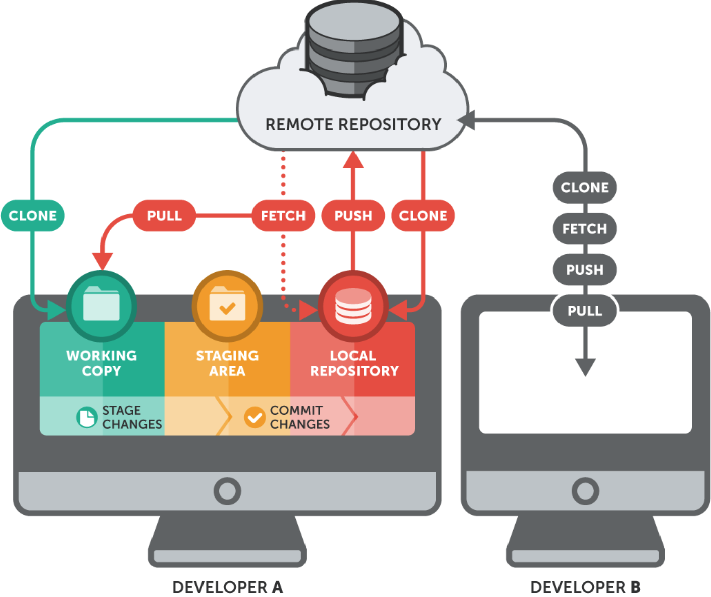
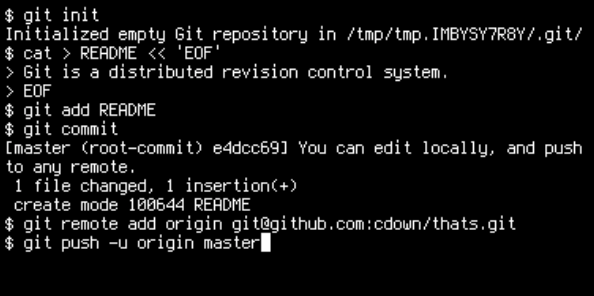
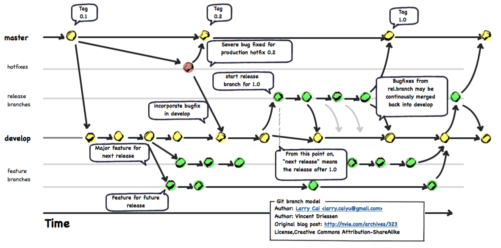

# Day 2:

Topics: Git and Github

## Learning Competencies

By the end of this lesson, you should be able to:

- Navigating a commit history: Learn what makes Git such a powerful tool for developers and dive right into working with Git Commit histories
							   using an existing project
- Creating and modifying Repository: Take next steps in learning git ie. create a repository, make commits, manage branches and merges.

- Using Github to collaborate: Use Git along with Github to collaborate on codebases with multiple developers. Learn to pull request workflow
							   for managing commits
- Use git stash to temporarily store that state of the working directory & understand the value of git stash when a clean working directory is necessary
- Rebasing the content
- Learn how to revert back to history

# Overview

Web Developers use tools to track their progress and create backups. Github is a popular platform for this, especially in the open-source community. In this challenge, we want to introduce you to GitHub so you don't feel lost when working through the material.

## A Short History of Git

As with many great things in life, Git began with a bit of creative destruction and fiery controversy.

The Linux kernel is an open source software project of fairly large scope. For most of the lifetime of the Linux kernel maintenance(1991–2002), changes to the software were passed around as patches and archived files. In 2002, the Linux kernel project began using a proprietary DVCS called BitKeeper.

In 2005, the relationship between the community that developed the Linux kernel and the commercial company that developed BitKeeper broke down, and the tool’s free-of-charge status was revoked. This prompted the Linux development community (and in particular Linus Torvalds, the creator of Linux) to develop their own tool based on some of the lessons they learned while using BitKeeper. Some of the goals of the new system were as follows:

- Speed
- Simple design
- Strong support for non-linear development (thousands of parallel branches)
- Fully distributed

Able to handle large projects like the Linux kernel efficiently (speed and data size)

Since its birth in 2005, Git has evolved and matured to be easy to use and yet retain these initial qualities. It’s amazingly fast, it’s very efficient with large projects, and it has an incredible branching system for non-linear development

Must Read!!!! [Difference b/w Git & Github](https://stackoverflow.com/questions/13321556/difference-between-git-and-github)

## Checkout

If you want to remove files from the working directory (before they have been staged) you can use `git checkout NAME_OF_FILE`.

Create a new git repository, then add and commit a blank file called first.txt. Once you've committed the file, `echo hello > first.txt` to add some text to the file. If you check `git status` now, you'll see that first.txt is not staged for commit. If you decide that you don't like the change you just made to the file, you can type `git checkout -- first.txt`. If you `cat first.txt` you'll see the file is empty again!

### clean
If you are dealing with an untracked or unmerged file, you cannot use `git checkout` to remove it from the working directory. You must use `git clean -df` to remove these files. Be careful with this - you can not undo this command either! (Curious about the `-df` flags? Run `man git-clean` to learn more about this command!)

### git rm --cached
We've seen what to do if we have something in the working directory that we want to remove. But what if we accidentally add something to the staging area and want to move it back to the working directory? To do this, you can type `git rm --cached NAME_OF_FILE`. If you need to remove a folder pass the `-r` flag to `git rm --cached`. If you want to move all of your files in the staging area to the working area you can type `git rm -r --cached ..` If you want to remove your files from the staging area AND the working directory, you can type `git reset --hard HEAD`, but be careful - this can not be undone!

### Undoing commits with reset
We've seen how to remove things from the working directory, and how to remove things from the staging area back into the working directory. But sometimes we end up committing things we do not want to be remembered. To undo commits we can use the `git reset` command. There are 3 flags we can pass to this:

- `git reset --soft COMMIT_SHA` - moves the files committed back to the staging area

- `git reset --mixed COMMIT_SHA` - moves the files committed back to the working directory (if you use git reset without a flag, the default will be --mixed)

- `git reset --hard COMMIT_SHA` - undoes the entire commit (dangerous!!!)

What's the `COMMIT_SHA`, you ask? You may have noticed that every commit has a unique identifier, called a sha, which identifies that commit. If you type `git log --online`, you'll see your list of commit messages along with the first seven characters of the commit sha. This is what you should pass into each of these commands.

## Branching

So far in our Git workflow we've only been working on a single branch. But when you're working with a team, this isn't usually desirable. What if you want to go off on your own and work on some experimental new feature? It would be nice if you could do so without worrying about breaking the code for everyone else, or conflicting with things that other people are working on.

In most modern work flows, we do not do all of our work on a single branch. Instead, we usually have many different branches for certain use cases (bug fixes, new features, deployment), so it's essential to understand how to create, delete, and merge branches.

Before creating a branch, let's first type git branch in the terminal. You should see a list of all your branches; right now, there should just be a single branch called master. This is the default branch for all Git repositories.

To create a new branch we use the git checkout command with the -b flag and then pass in a name of a branch. This looks like `git checkout -b NAME_OF_BRANCH`.

If we want to move to another branch that has been previously created we use the git checkout command and then specify the name of a branch. This looks like `git checkout NAME_OF_BRANCH`

To delete a branch we make sure we are not on that branch and then run `git branch -D NAME_OF_BRANCH`

To see all of the branches we have, we can type `git branch -a`. The -a flag will include remote branches (branches on GitHub or other remote locations). The flag does not matter right now, but it's good to get in the habit of using it with the git branch command.

Try creating a branch called second branch. When you type `git branch -a`, you should now see two branches; your current branch will have an asterisk next to it. You can now add and commit files to the two branches completely independently of one another! Try this out by adding separate files to each branch.

Below is how Git Branches look like:

## Merging

### Wiki Says
In version control, merging is a fundamental operation that reconciles multiple changes made to a version-controlled collection of files. Most often, it is necessary when a file is modified on two independent branches and subsequently merged. The result is a single collection of files that contains both sets of changes.

### Why to use it?
When you develop applications in a team-based environment, you might need to access multiple versions of your application at the same time. If you copy one or more areas of your code into a separate branch, you can update one copy while you preserve the original version, or you can update both branches to meet different needs. Depending on your development goals, you can later merge the changes from multiple branches to create a single version that reflects all changes.

When we want to move changes from one branch to another, we use the `git merge` command. Depending on the history of our commits, we can merge two different ways:

#### Fast forward
#### Recursive

In the previous section, we saw a fast forward merge, which is when git can easily tell when the commits happened and "put" on set of commits on top of another chronologically.

When different commits happen at different times on two branches, and git can not easily determine what order these commits happened in, a recursive merge needs to happen. You don't need to know the details of how the recursive strategy works; just know that it's an algorithm, git uses to try to merge branches when a simple fast-forward merge won't suffice. (If you'd like to learn more, type `man git-merge` to check out the documentation.)

## Stashing

Sometimes you are working with certain files and do not want to add and commit them, but you do not want to discard them either. For example, maybe you're right in the middle of working on some feature when a huge update gets pushed to your remote upstream, and you need to pull the changes in right away to be sure that the code you're writing still works.

When you try to pull or merge code and you have changes in your working directory, git won't let the pull or merge to go through. In other words, you can't merge code into the branch you're working on unless your working directory is clean. So, what should you do if you're working directory isn't clean, but you aren't ready to commit yet? This is a perfect example of where stashing can help. You can think of stashing as a temporary way of remembering changes without making an official commit.

Here are the commands you can using when stashing:

- `git stash` - stash your commits (same as git stash save)
- `git stash list` - show the list of stashed changes
- `git stash apply` - move the latest stashed change back into the working directory, but keep it on the list
- `git stash pop` - move the latest stashed change back into the working directory and remove it from the list
- `git stash show` - show the latest stash
- `git stash show stash@{number}` - show a specific stashed change

## Rebasing

### Wiki Says
Rebasing is the act of moving changesets to a different branch when using a revision control system, or, in some systems, by synchronizing a branch with the originating branch by merging all new changes in the latter to the former. 

### When to use it?

Merge takes all the changes in one branch and merges them into another branch in one commit.

Rebase says I want the point at which I branched to move to a new starting point

So when do you use either one?

- Merge

> Let's say you have created a branch for the purpose of developing a single feature. When you want to bring those changes back to master, you probably want merge (you don't care about maintaining all of the interim commits).

- Rebase

> A second scenario would be if you started doing some development and then another developer made an unrelated change. You probably want to pull and then rebase to base your changes from the current version from the repo.

## Revert

The `git revert` command undoes a commit, but unlike `git reset`, which removes the commit from the commit history, it appends a new commit with the resulting content. This prevents Git from losing history, which is important for the integrity of your revision history and for reliable collaboration. When you are working on a repository with other developers, using `git reset` is **highly dangerous** because you alter the history of commits which makes it very difficult to maintain a consistent history of commits with other developers.

# Exploration

### - Changing author info

To change the name and/or email address recorded in existing commits, you must rewrite the entire history of your Git repository.

> Warning: This action is destructive to your repository's history. If you're collaborating on a repository with others, it's considered bad practice to rewrite published history. You should only do this in an emergency.

READ MORE [here](https://help.github.com/articles/changing-author-info/)

### - SubTree

If you need to manage multiple projects within a single repository, you can use a subtree merge to handle all the references.

Typically, a subtree merge is used to contain a repository within a repository. The "subrepository" is stored in a folder of the main repository.

Please refer to this [documentation](https://help.github.com/articles/about-git-subtree-merges/) for more information on subtrees

### - Checkout

- Read Git Checkout documentation: [here](https://git-scm.com/docs/git-checkout)

### - Branching & Merging

- [Read more about Github branching & merging](https://git-scm.com/book/en/v2/Git-Branching-Basic-Branching-and-Merging)
- A very interesting article A successful Git branching model by Vincent Driessen. Read [here](http://nvie.com/posts/a-successful-git-branching-model/)
- Read Git Merge Documentation [here](https://git-scm.com/docs/git-merge)
- An excellent tutorial on Git Merge. Read [here](https://www.atlassian.com/git/tutorials/git-merge)

### - Stashing

- Read Git Stash documentation [here](https://git-scm.com/docs/git-stash)
- Read an excellent tutorial on stashing [here](https://www.atlassian.com/git/tutorials/git-stash)

### - Rebasing

- Dive deep into rebasing [Rebasing](https://www.atlassian.com/git/tutorials/merging-vs-rebasing) excellent tutorial on Atlassian. Then answer the following questions

