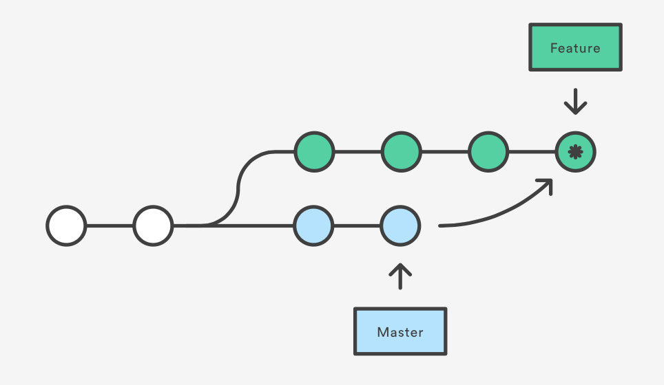
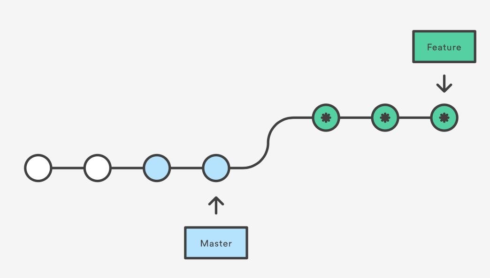

# Release0: Rebasing
- What is the difference between git merge and git rebase. When would you use one over the other?
- What kinds of things can you do in interactive mode when rebasing?

# Release1: Rebasing vs Merge

From two picture below identify which one is merge and which one is stash?

### vs

